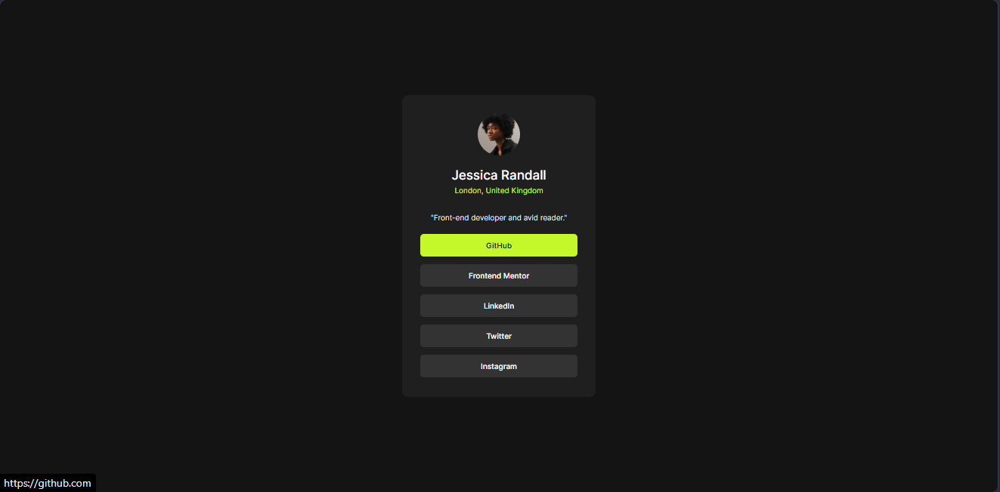

# Frontend Mentor - Social links profile solution

This is a solution to the [Social links profile challenge on Frontend Mentor](https://www.frontendmentor.io/challenges/social-links-profile-UG32l9m6dQ). Frontend Mentor challenges help you improve your coding skills by building realistic projects. 

## Table of contents

- [Overview](#overview)
  - [The challenge](#the-challenge)
  - [Screenshot](#screenshot)
  - [Links](#links)
- [My process](#my-process)
  - [Built with](#built-with)
  - [What I learned](#what-i-learned)
  - [Continued development](#continued-development)

## Overview

### The challenge

Users should be able to:

- See hover and focus states for all interactive elements on the page

### Screenshot



### Links

- Live Site URL: [social-links demo](https://siddlopez.github.io/social-links-profile/)

## My process

### Built with

- Semantic HTML5 markup
- CSS custom properties
- CSS Flexbox
- Mobile-first workflow
- Local imported fonts (@font-face)

### What I learned

I have never used the mobile-first workflow before, it was the first time that I deployed different styles for different sreens and widths. It is actually interesting to think about how every screen needs its own style.

```css
@media screen and (min-width: 1400px){
  ...
}
```

Another of my learnings in this solution was how cascade and specificity works in CSS, this helped me to overwrite some styles using different selectors,w each one with its own specificity level.

Last but not least, in the past projects I used imported online fonts, mainly from google fonts. This time I decided to import the local fonts that comes with the Frontend-mentor download Kit for this solution. It was pretty easy, but still new for me.

```css
@font-face{
    font-family: 'Inter';
    src: url('./assets/fonts/Inter-VariableFont_slnt,wght.ttf') format('truetype');
}
```

### Continued development

In the future I want to keep implementing the mobile-first workflow, or any other workflow or method that keeps in mind the scalability of the style accross devices. Along with this, I hope it will become easier to make this style changes with new knowledge and tools I keep learning.

